# A2A Java Testcontainer - Architecture Documentation (arc42)

**Version:** 1.0  
**Date:** 2025-09-02  
**Authors:** Architecture Team  

---

## Table of Contents

1. [Introduction and Goals](#1-introduction-and-goals)
2. [Architecture Constraints](#2-architecture-constraints)  
3. [System Scope and Context](#3-system-scope-and-context)
4. [Solution Strategy](#4-solution-strategy)
5. [Building Block View](#5-building-block-view)
6. [Runtime View](#6-runtime-view)
7. [Deployment View](#7-deployment-view)
8. [Cross-cutting Concepts](#8-cross-cutting-concepts)
9. [Design Decisions](#9-design-decisions)
10. [Quality Requirements](#10-quality-requirements)
11. [Risks and Technical Debts](#11-risks-and-technical-debts)
12. [Glossary](#12-glossary)

---

## 1. Introduction and Goals

### 1.1 Requirements Overview

The A2A Java Testcontainer project provides a Docker-based integration testing solution for the A2A (Agent2Agent) protocol. It enables developers to easily test their A2A client implementations against a containerized A2A server instance.

**Key Requirements:**
- Provide simple Java API for starting/stopping A2A server containers
- Support health monitoring and readiness detection
- Enable flexible configuration with custom Docker images and environment variables
- Offer rich API for agent interactions, message sending, and health checks
- Support multiple concurrent A2A server instances
- Integrate seamlessly with existing testing frameworks

### 1.2 Quality Goals

| Priority | Quality Goal | Scenario |
|----------|--------------|----------|
| 1 | **Usability** | Developers can set up A2A server integration tests with minimal configuration |
| 2 | **Reliability** | Container startup and health checks work consistently across environments |
| 3 | **Flexibility** | Support various A2A server configurations and multiple concurrent instances |
| 4 | **Performance** | Fast container startup and efficient resource usage during tests |

### 1.3 Stakeholders

| Role | Contact | Expectations |
|------|---------|--------------|
| Java Developers | Development Teams | Easy-to-use API for A2A integration testing |
| QA Engineers | Test Teams | Reliable and consistent test environment |
| DevOps Engineers | Infrastructure Teams | Containerized solution that integrates with CI/CD |
| A2A Protocol Users | Client Implementers | Reference implementation for testing A2A clients |

---

## 2. Architecture Constraints

### 2.1 Technical Constraints

| Constraint | Description |
|------------|-------------|
| **Java Version** | Minimum Java 11+ required |
| **Docker** | Docker engine must be available for container execution |
| **Testcontainers** | Built on Testcontainers framework |
| **A2A Protocol** | Implements A2A protocol version 0.3.0 |
| **Quarkus** | A2A server runs on Quarkus framework |

### 2.2 Organizational Constraints

| Constraint | Description |
|------------|-------------|
| **Open Source** | Project follows open source development practices |
| **Maven** | Uses Maven for build and dependency management |
| **Testing Focus** | Designed specifically for integration testing scenarios |

---

## 3. System Scope and Context

### 3.1 Business Context

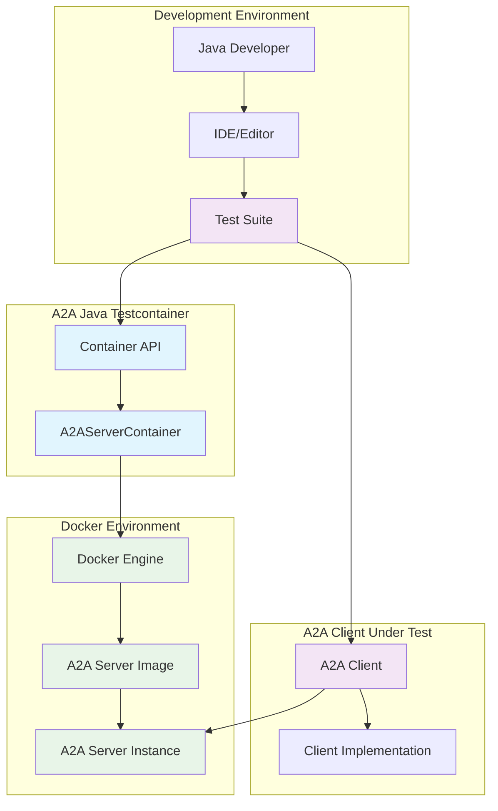

### 3.2 Technical Context

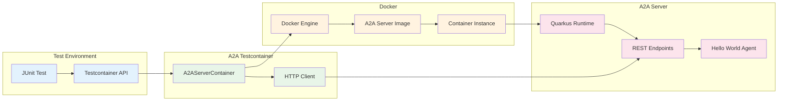

---

## 4. Solution Strategy

### 4.1 Architecture Approach

The solution follows a **Wrapper Pattern** approach, encapsulating Docker container management within a Java API that extends the Testcontainers framework.

**Key Strategies:**
- **Container Abstraction**: Hide Docker complexity behind simple Java methods
- **Health Monitoring**: Implement robust health checks and readiness detection
- **HTTP Communication**: Use standard HTTP clients for A2A protocol communication
- **Configuration Flexibility**: Support environment variables and custom images
- **Test Integration**: Design API specifically for testing scenarios

### 4.2 Technology Stack

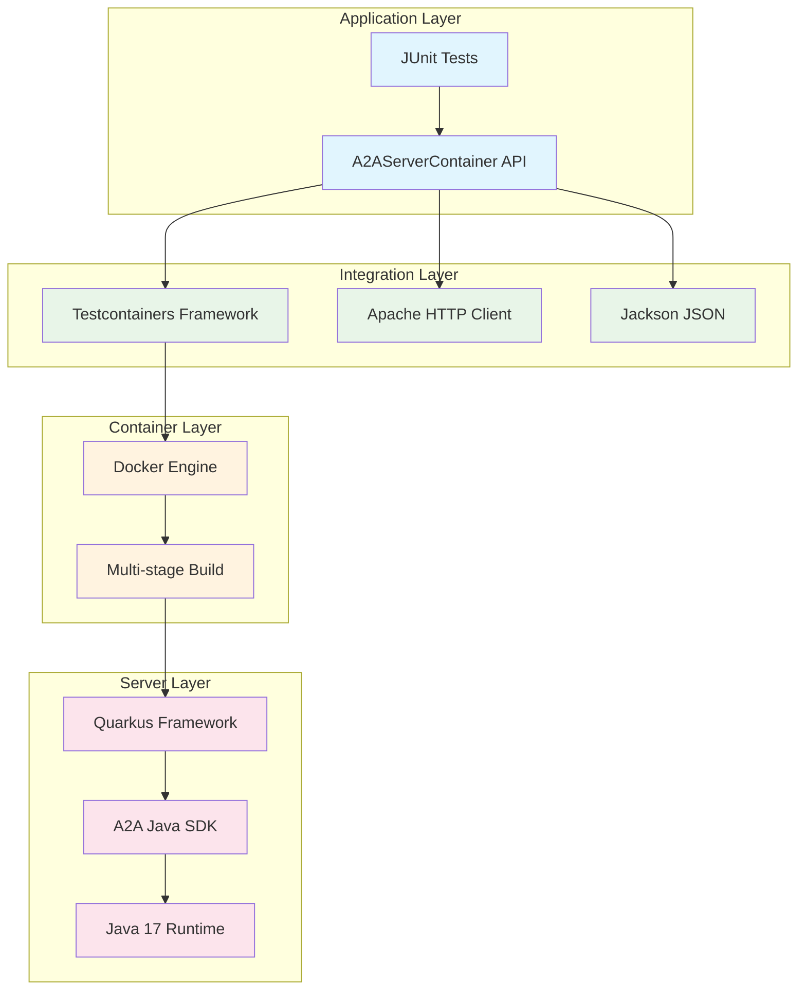

---

## 5. Building Block View

### 5.1 Level 1 - System Overview

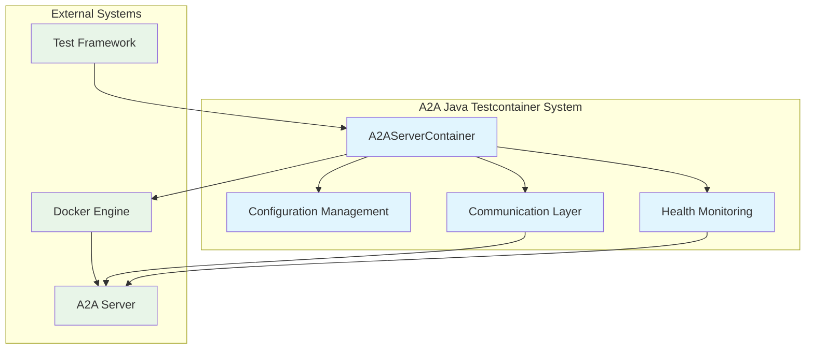

### 5.2 Level 2 - A2AServerContainer Details

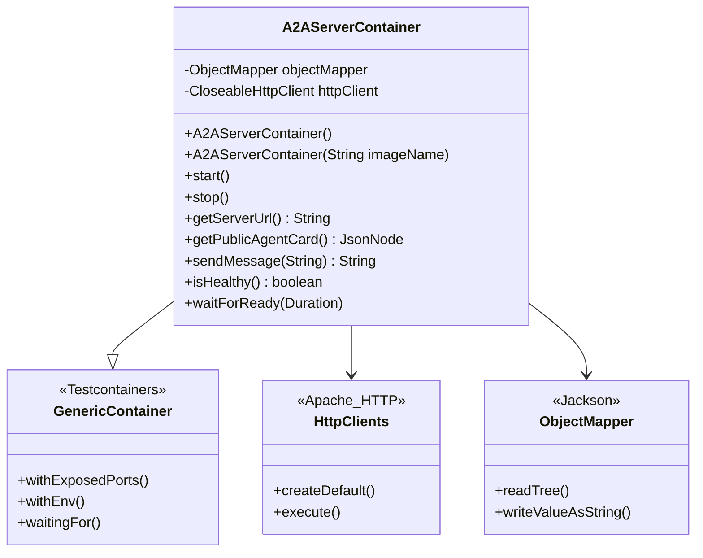

### 5.3 Level 3 - Docker Image Structure

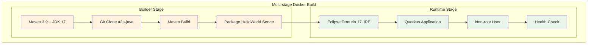

---

## 6. Runtime View

### 6.1 Container Startup Sequence

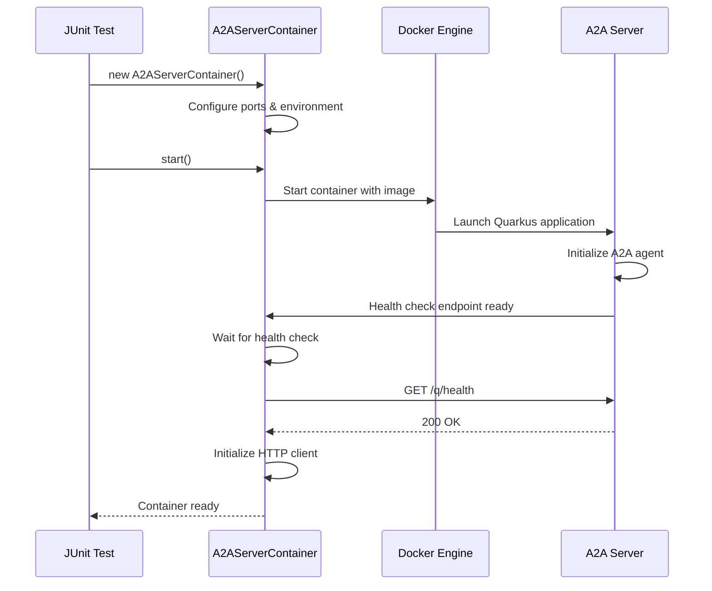

### 6.2 Message Exchange Flow

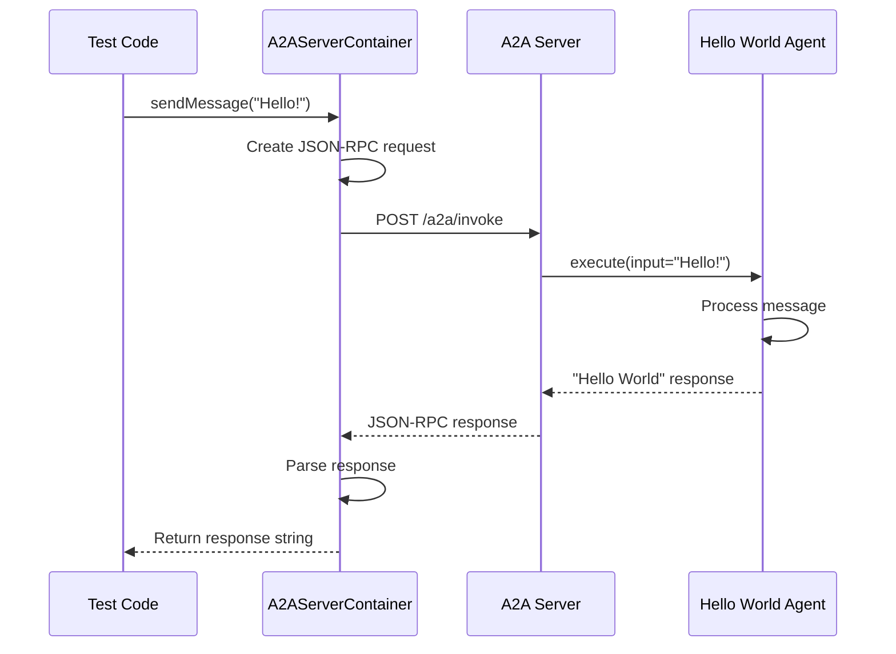

### 6.3 Health Monitoring Flow

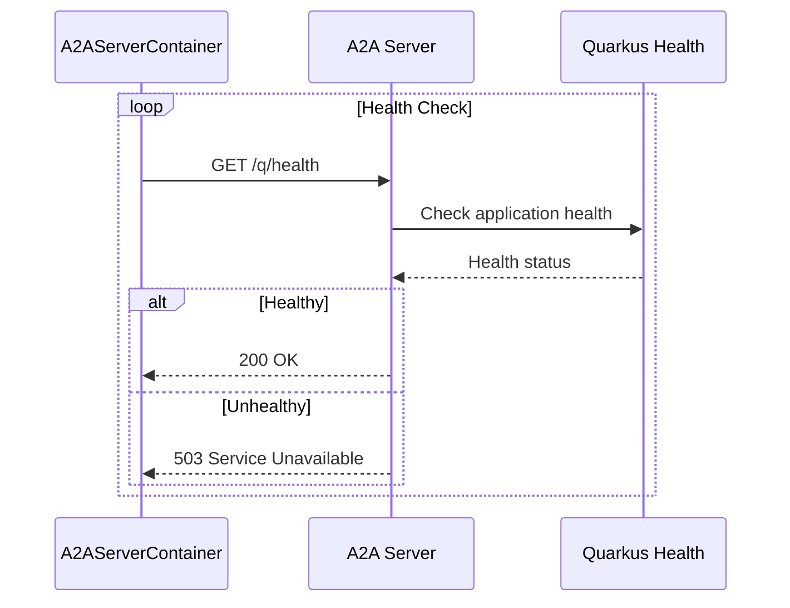

---

## 7. Deployment View

### 7.1 Development Environment

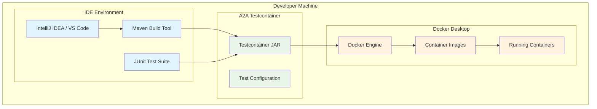

### 7.2 CI/CD Pipeline

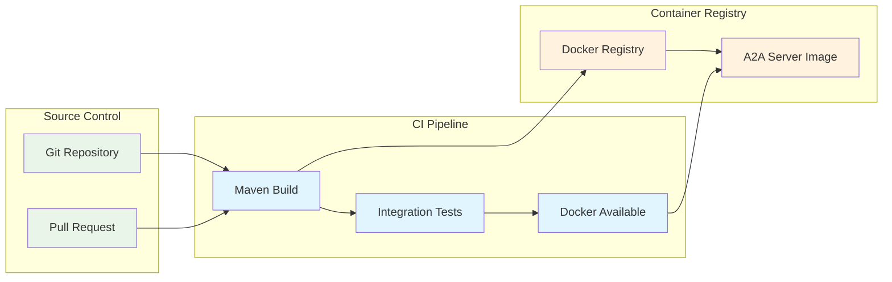

### 7.3 Container Infrastructure

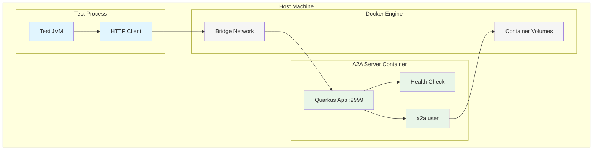

---

## 8. Cross-cutting Concepts

### 8.1 Logging and Monitoring

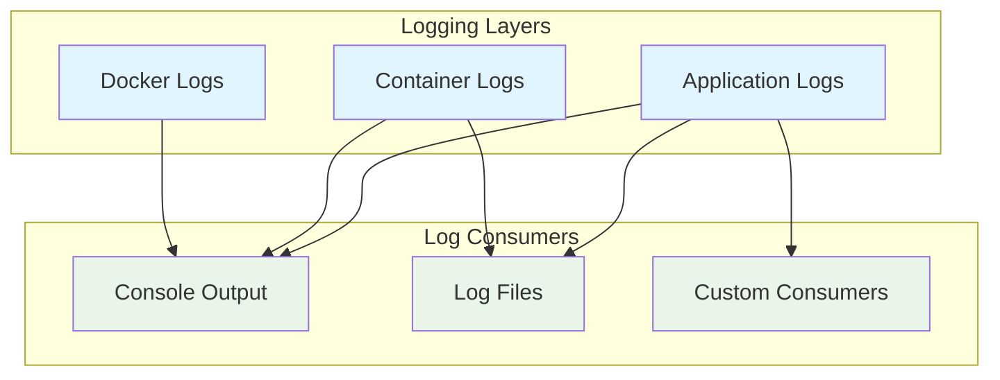

### 8.2 Error Handling

| Layer | Error Type | Handling Strategy |
|-------|------------|-------------------|
| **Container** | Docker startup failures | Retry with timeout, detailed error messages |
| **HTTP Communication** | Connection errors | HTTP client retries, IOException wrapping |
| **Health Checks** | Server unavailable | Graceful degradation, boolean return |
| **JSON Processing** | Parse errors | Jackson exception handling, error logging |

### 8.3 Configuration Management

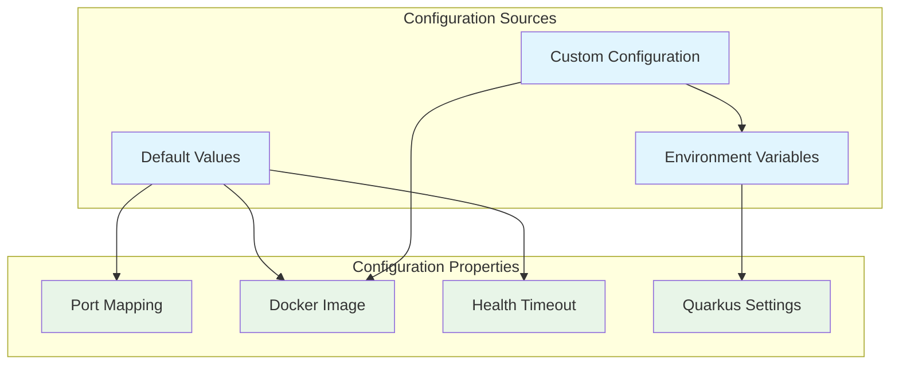

---

## 9. Design Decisions

### 9.1 Technology Choices

| Decision | Rationale | Alternatives Considered |
|----------|-----------|------------------------|
| **Testcontainers Framework** | Industry standard for container-based testing | Custom Docker integration |
| **Apache HTTP Client** | Mature, reliable HTTP communication | OkHttp, Java 11 HTTP Client |
| **Jackson JSON** | De facto standard for JSON processing in Java | Gson, native JSON processing |
| **Quarkus for A2A Server** | Fast startup, cloud-native Java framework | Spring Boot, traditional Jakarta EE |

### 9.2 Architecture Decisions

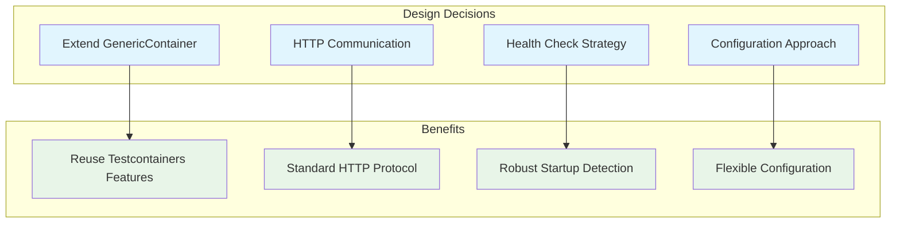

### 9.3 Trade-offs

| Trade-off | Decision | Rationale |
|-----------|----------|-----------|
| **Startup Time vs Reliability** | Longer timeout (3 minutes) | Ensures reliable container startup across environments |
| **API Simplicity vs Flexibility** | Simple API with extension points | Easy to use for common cases, extensible for complex scenarios |
| **Resource Usage vs Isolation** | One container per test instance | Better isolation, acceptable resource overhead for testing |

---

## 10. Quality Requirements

### 10.1 Quality Tree

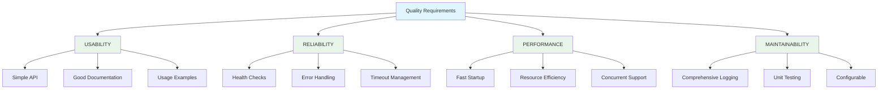

### 10.2 Quality Scenarios

| Quality | Scenario | Response |
|---------|----------|----------|
| **Usability** | Developer needs to test A2A client | Can create and start container with 3 lines of code |
| **Reliability** | Docker daemon stops during test | Container fails gracefully with clear error message |
| **Performance** | Running 10 concurrent containers | Each container starts within 30 seconds, acceptable memory usage |
| **Maintainability** | Need to support new A2A version | Configuration allows custom Docker image specification |

---

## 11. Risks and Technical Debts

### 11.1 Identified Risks

| Risk | Probability | Impact | Mitigation Strategy |
|------|-------------|---------|-------------------|
| **Docker Availability** | Medium | High | Clear error messages, documentation for Docker setup |
| **A2A Server Changes** | Low | Medium | Version pinning, configurable Docker images |
| **Port Conflicts** | Low | Low | Dynamic port allocation by Testcontainers |
| **Resource Consumption** | Medium | Medium | Container cleanup, resource monitoring |

### 11.2 Technical Debts

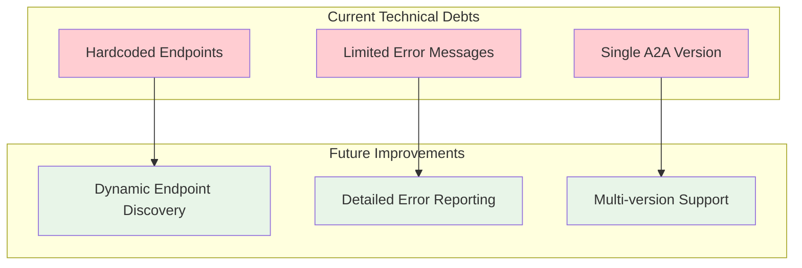

### 11.3 Evolution Path

| Priority | Improvement | Timeline | Effort |
|----------|-------------|----------|--------|
| High | Enhanced error messages | Next release | Low |
| Medium | Multi-version A2A support | 3 months | Medium |
| Low | Performance optimizations | 6 months | High |

---

## 12. Glossary

| Term | Definition |
|------|------------|
| **A2A** | Agent2Agent - A protocol for communication between autonomous agents |
| **Agent Card** | JSON document describing an agent's capabilities and contact information |
| **GenericContainer** | Testcontainers base class for Docker container management |
| **Health Check** | Automated verification that a service is running and ready to accept requests |
| **JSON-RPC** | Remote procedure call protocol encoded in JSON |
| **Quarkus** | Java framework optimized for cloud and containerized applications |
| **Testcontainers** | Java library for integration testing with Docker containers |

---

## Appendix

### A.1 Reference Documentation

- [A2A Java SDK Documentation](https://github.com/a2aproject/a2a-java)
- [Testcontainers Documentation](https://www.testcontainers.org/)
- [Quarkus Framework](https://quarkus.io/)
- [Docker Documentation](https://docs.docker.com/)

### A.2 Related Projects

- A2A Java SDK - Core A2A protocol implementation
- A2A Specification - Official A2A protocol specification
- Testcontainers - Container-based integration testing framework

---

*This document follows the arc42 template for architecture documentation.*